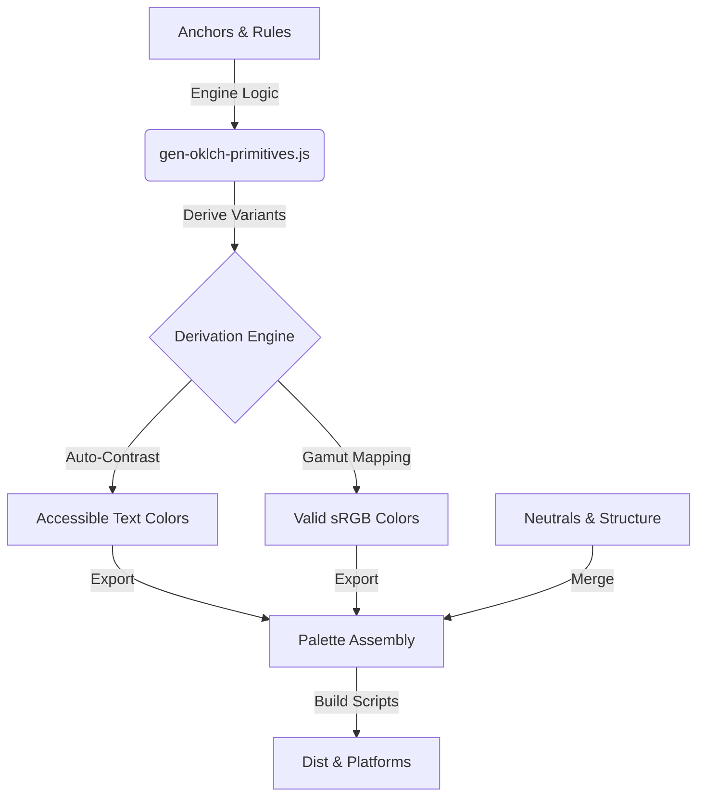

# Candi System Architecture

## 1. Core Philosophy

Expose intent, derive variation.

We define a minimal set of semantic anchors and programmatically derive all variants. This ensures consistency, accessibility, and maintainability.

## 2. Token Pipeline

### 2.1 The Single Source of Truth

The system's Single Source of Truth (SSOT) is a unified concept composed of two parts with disparate responsibilities:

1. Derivation Engine (`scripts/gen-oklch-primitives.js`): Defines the mathematical rules and semantic anchors.
2. Palette Assembly (`src/data/colors.js`): Merges engine output with hand-tuned neutrals and structural definitions.

### 2.2 The Engine (`scripts/gen-oklch-primitives.js`)

Responsible for:

1. Defining Anchors: `accent`, `secondary`, `success`, `warning`, `error`, `info`.
2. Derivation Rules:
    - `Light`: `subtle` (L+33, C*0.80 - Lagom), `soft`, `strong`, `outline`.
    - `Dark`: `subtle` (L-27, C*0.80 - Lagom), `soft`, `strong`, `outline`.
3. Guardrails:
    - WCAG Contrast: Automatically selects White or Black for text on anchors.
    - Gamut Correction: Binary search reduces Chroma if OKLCH -> sRGB clips.

## 3. Naming Contract

- Internal (JS): `camelCase` (e.g., `warningSubtle`).
- External (CSS/Public): `kebab-case` (e.g., `--candi-warning-subtle`).

## 4. Maintenance

- To Change an Anchor: Edit `ANCHORS` in `scripts/gen-oklch-primitives.js`.
- To Change a Rule: Edit `VARIANTS` in `scripts/gen-oklch-primitives.js`.
- NEVER manually edit a semantic token's value in `colors.js` output or intermediate files.
