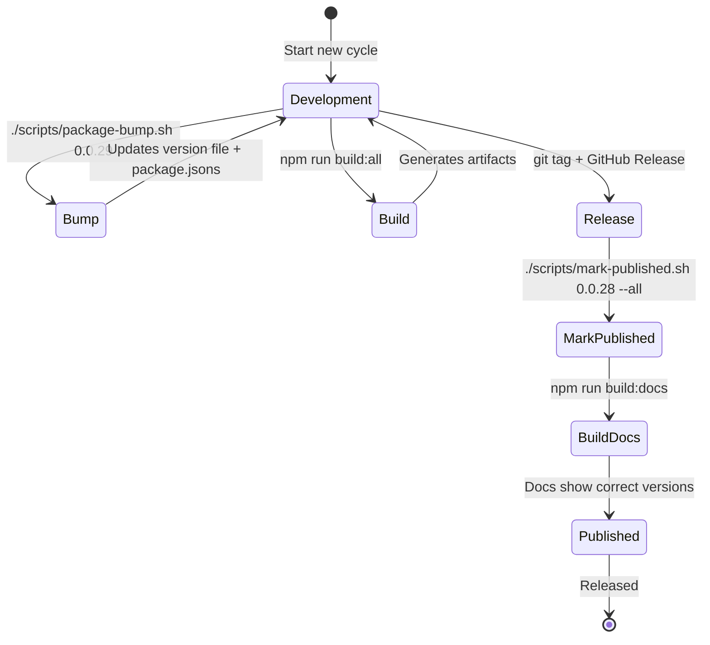
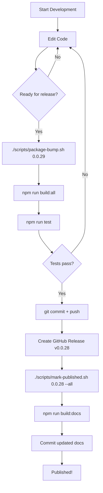
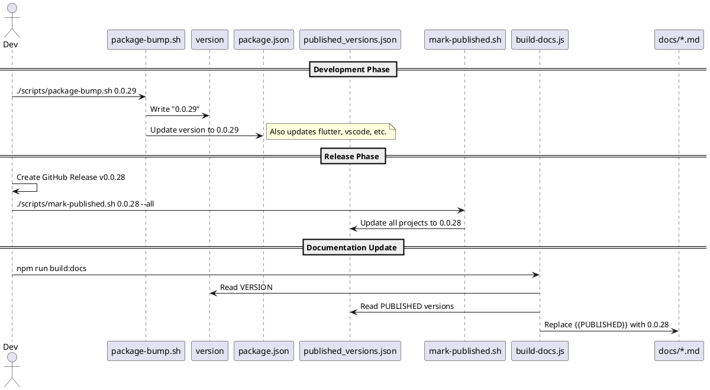

# Versioning System

This document describes the Candi version management system, including all version files, scripts, and their state transitions.

## Version Files

| File | Purpose | Updated By | Example |
|------|---------|------------|---------|
| `version` | Current dev version | `package-bump.sh` | `0.0.28` |
| `package.json` | npm package version | `package-bump.sh` | `"version": "0.0.28"` |
| `published_versions.json` | Per-project published versions | `mark-published.sh` or manual | See below |
| `flutter/pubspec.yaml` | Flutter package version | `package-bump.sh` | `version: 0.0.28` |
| `vscode/package.json` | VSCode extension version | `package-bump.sh` | `"version": "0.0.28"` |
| `obsidian/manifest.json` | Obsidian theme version | `package-bump.sh` | `"version": "0.0.28"` |

## published_versions.json

Per-project published versions for documentation. Human edits are respected.

```json
{
    "github": "0.0.27",
    "npm": "0.0.23",
    "flutter": "0.0.27",
    "vscode": "0.0.27",
    "kde": "0.0.27",
    "gnome": "0.0.27",
    "obsidian": "0.0.27",
    "vim": "0.0.27"
}
```

## Available Placeholders

Used in documentation files (`docs/*.md`, `README.md`):

| Placeholder | Source | Description |
|-------------|--------|-------------|
| `{{VERSION}}` | `version` file | Current dev version |
| `{{PUBLISHED}}` | `published_versions.json → github` | Latest GitHub release |
| `{{NPM_VERSION}}` | `published_versions.json → npm` | npm package version |
| `{{FLUTTER_VERSION}}` | `published_versions.json → flutter` | Flutter pub version |
| `{{VSCODE_VERSION}}` | `published_versions.json → vscode` | VSCode marketplace |
| `{{KDE_VERSION}}` | `published_versions.json → kde` | KDE Store version |
| `{{GNOME_VERSION}}` | `published_versions.json → gnome` | GNOME version |
| `{{OBSIDIAN_VERSION}}` | `published_versions.json → obsidian` | Obsidian version |
| `{{VIM_VERSION}}` | `published_versions.json → vim` | Vim version |

---

## Scripts

### package-bump.sh

Bumps the development version across all packages.

```bash
./scripts/package-bump.sh 0.0.29
```

**Updates:**

- `version` file
- `package.json`
- `vscode/package.json`
- `website/package.json`
- `flutter/pubspec.yaml`
- `obsidian/manifest.json`
- `showcase_flutter/pubspec.yaml`

### mark-published.sh

Marks versions as published after a successful release.

```bash
# Update all projects
./scripts/mark-published.sh 0.0.28 --all

# Update specific projects
./scripts/mark-published.sh 0.0.28 --npm
./scripts/mark-published.sh 0.0.28 npm flutter vscode
```

### build-docs.js

Injects versions into documentation by replacing placeholders.

```bash
npm run build:docs
```

---

## State Diagram



---

## Workflow Diagram



---

## Sequence Diagram



---

## Version State Table

Example state during development of v0.0.29 after releasing v0.0.28:

| Component | File | Value | Meaning |
|-----------|------|-------|---------|
| Dev Version | `version` | 0.0.29 | Next version being developed |
| npm Package | `package.json` | 0.0.29 | Ready for next publish |
| GitHub Release | `published_versions.json → github` | 0.0.28 | Latest downloadable release |
| npm Published | `published_versions.json → npm` | 0.0.23 | Currently on npmjs.com |
| Flutter Published | `published_versions.json → flutter` | 0.0.27 | Currently on pub.dev |
| Docs Examples | After `build:docs` | 0.0.28 | Shows latest GitHub release |

---

## Human Editing

The `published_versions.json` file can be manually edited:

1. **Partial updates** — Update only specific projects
2. **Different versions** — Each project can have independent versions
3. **Script respects edits** — `mark-published.sh` only updates specified projects

Example: Update only npm after npm publish:

```bash
./scripts/mark-published.sh 0.0.25 --npm
# Only npm key is updated, others remain unchanged
```
